<style>
section {
  background-image: url('./img/background.png');
  background-size: cover;
  background-position: center;
  font-size: 200%;
}
</style>
<!-- _class: lead -->
# ESP Motor Control
YanKE

---
## Motor Control：基本概念
#### 无刷电机的优势

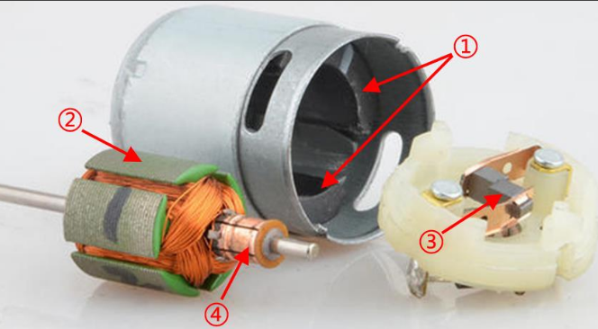
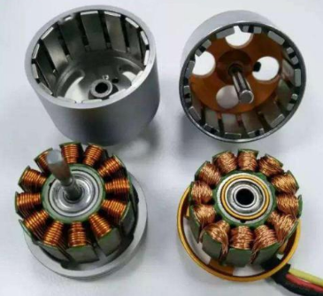

* **电子换向**：基于三相逆变电路实现电流换向,更高的使用寿命
* **精密控制**：通过适当的电子控制实现精确的速度和位置控制

<!-- 右手螺旋定则，改变磁场，吸引转子磁铁转动-->
<!-- 1.定子 2.转子 3.电刷 4.换向器-->
---
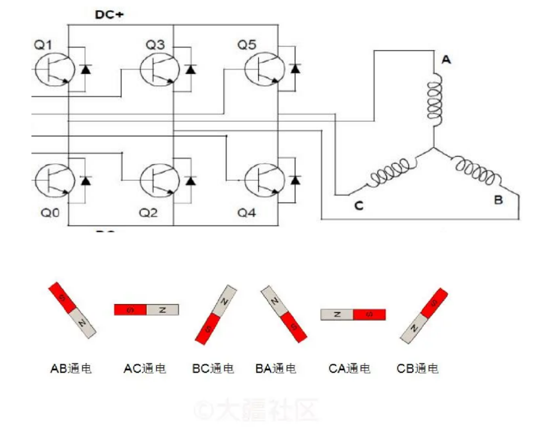

依次控制6个MOS的开关，牵引转子转动
* 当MOS管开关的速度变快，那么就可以加速转子的转动。
* 当MOS管开关的速度变慢，那么转子的转动速度减慢。

至于什么时候怎么知道该换到哪个供电相？如何产生更平滑的换向电压？如何提高电源的利用效率？

---

## Motor Control：FOC

1. 电机控制是自动化控制领域重要一环。
2. 目前直流无刷电机应用越来越广泛，如无人机、机械臂等。

* clark变换：三相坐标系转换为两相坐标系
* park变换：两相坐标系转换为转子坐标系
* svpwm：控制每个状态的通电时间，控制转子到达任意位置


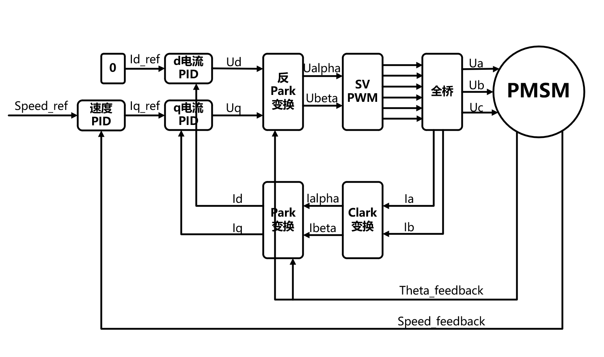


---

## Clark变换：
实现了三向坐标系(ia,ib,ic)与直角坐标系(ialpha,ibeta)的转换。

$\begin{bmatrix}
I_{\alpha}\\
I_{\beta}
\end{bmatrix} =\begin{bmatrix}
 1 & -\frac{1}{2} & -\frac{1}{2}  \\
 0 & \frac{\sqrt{3} }{2}  & -\frac{\sqrt{3} }{2}
\end{bmatrix}\begin{bmatrix}
I_{a}
 \\
I_{b}
 \\
I_{c}
\end{bmatrix}$

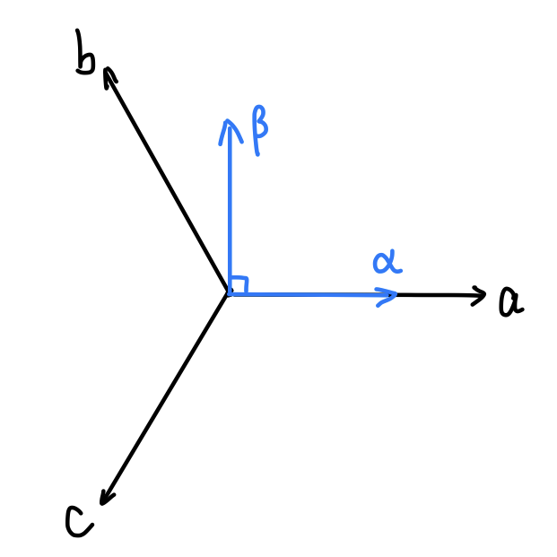

---

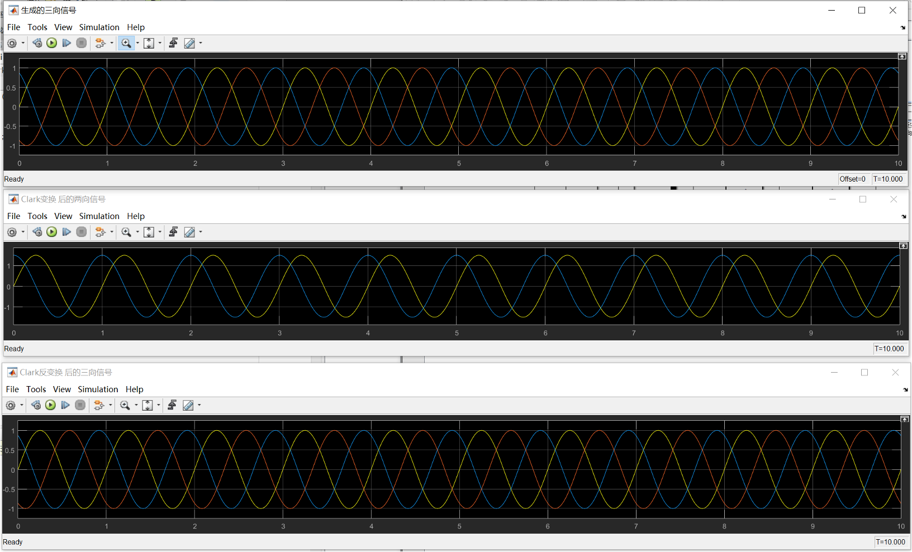

---

### Park变换：
两相坐标系(Ialpha,Ibeta)到转子坐标系(d,q)的转换


$\begin{bmatrix}
I_{d}
 \\
I_{q}
\end{bmatrix}
=\begin{bmatrix}
 cos\theta  & sin\theta  \\
  -sin\theta & cos\theta 
\end{bmatrix} \begin{bmatrix}
I_{\alpha }
 \\
I_{\beta}
\end{bmatrix}$

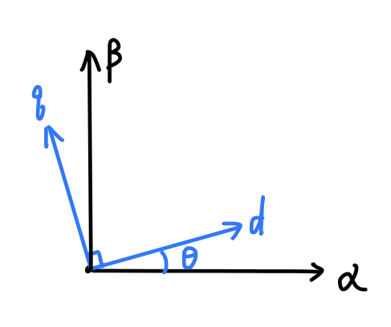

---


---

## 为什么要做clark/park变换？

#### 解耦

将相互耦合的三相磁链解耦为容易控制的交轴$I_{d}$和$I_{q}$。
以这两个值作为反馈控制的对象，同时可以使用一些线性控制器来进行控制。

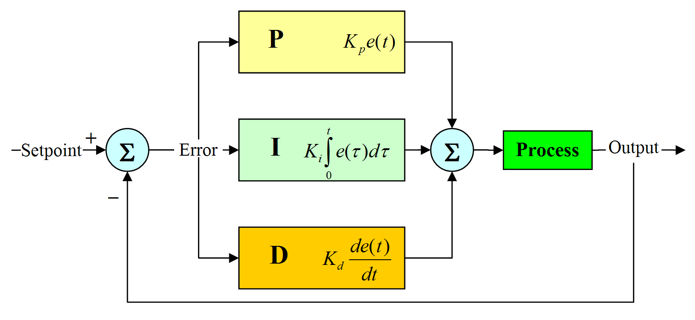

---

#### SVPWM

$s_{x}=\begin{Bmatrix}
1, 上桥臂导通
 \\
0, 下桥臂导通
\end{Bmatrix}$


---
$(S_{a},S_{b},S_{c})$的组合包含8个。

| 矢量 | a桥 | b桥 | c桥 |
|:---:|:---:|:---:|:---:|
| 0  | 0  | 0  | 0  |
| 4  | 1  | 0  | 0  |
| 6  | 1  | 1  | 0  |
| 2  | 0  | 1  | 0  |
| 3  | 0  | 1  | 1  |
| 1  | 0  | 0  | 1  |
| 5  | 1  | 0  | 1  |
| 7  | 1  | 1  | 1  |

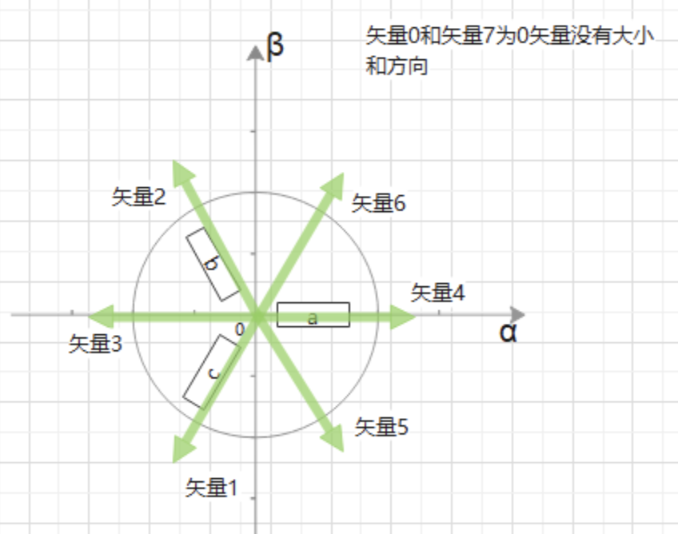

---

假设我们的电机处于0°位置。

那么要想让电机转动起来我们只需要产生一个30°的矢量，那么只需要在一个周期内矢量4和矢量6作用的时间各占一半即可产生一个30°的矢量。同时我们可以插入0矢量来改变矢量的大小。

**一个控制周期内通过8个矢量的配比来产生任意方向和任意大小的矢量**。


---

#### SVPWM为什么能合成？
8个电压矢量在任意时刻只能有一个电压矢量起作用，由逆变桥的开关状态决定。

控制磁链形成磁场，电压矢量为磁链矢量的导数，控制磁链可以转换为控制电压。

假设让u1作用时间Δt，u1作用形成的磁链是u1对时间的积分。实际上在u1作用之前，是存在原来的磁链的，u1作用后只是在原来的基础上再有一个磁链增量。这个积分是由**定子电感**自身的特性来完成的。

如果用u1和u2两个电压矢量做合成，假设原来的磁链是Ψ0，实际上是让u1先作用，作用结果是Ψ0+Ψ1，再让u2作用，作用结果是Ψ0+Ψ1+Ψ2

---
#### SVPWM如何控制MOS开关

我们希望能尽量**减少MOS管的开关次数**,以最大限度减少开关损耗.
$T_{0} = \frac{T_{s}-T_{4}-T_{6}}{2}$

$T_{7} = \frac{T_{s}-T_{4}-T_{6}}{2}$

$T_{a} = \frac{T_{0}}{2} =\frac{T_{s}-T_{4}-T_{6}}{4}$ 

$T_{b}=T_{a}+\frac{T_{4}}{2}$

$T_{c}=T_{b}+\frac{T_{6}}{2}$

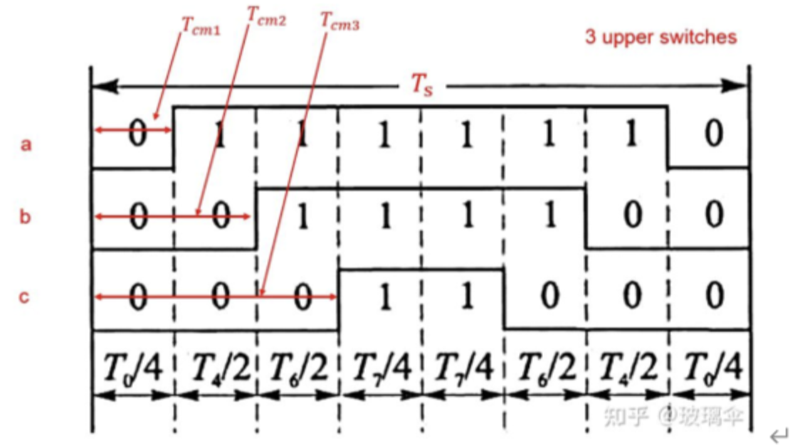

---

## Simplefoc-FOC

* 支持平台范围广
* 使用传感器进行扇区判断，简化计算复杂度
* 支持多类电机

```c++
// 角度归一化，在0和360°之间
// 仅当使用_sin和_cos近似函数时才需要
angle_el = normalizeAngle(angle_el + zero_electric_angle + _PI_2);

// 找到我们目前所在的象限
int sector = floor(angle_el / _PI_3) + 1;

```


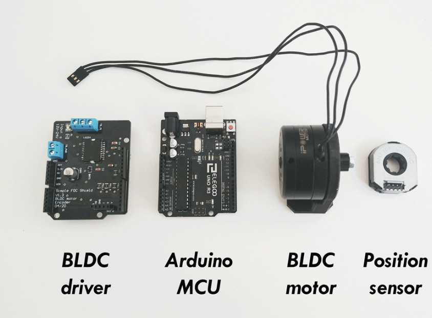


---


```c++
uint8_t JudgeSector(float ualpha, float ubeta)
{
    uint8_t sector = 0;

    float uref1 = ubeta;
    float uref2 = (SQRT3_2)*ualpha - (0.5f) * ubeta;
    float uref3 = (-SQRT3_2) * ualpha - (0.5f) * ubeta;

    if (uref1 > 0)
    {
        sector += 1;
    }

    if (uref2 > 0)
    {
        sector += 2;
    }

    if (uref3 > 0)
    {
        sector += 4;
    }

    return sector;
}
```

---

## Motor Control：项目进展

1. esp simplefoc组件/硬件

* 基于Adruino-FOC开源项目，移植IDF底层驱动，发布esp_simplefoc组件
* 修改Arduino-FOC BLDC类，**支持指定LEDC与MCPWM**，在3PWM模式下最多支持4电机控制
* 使用IQMATH数学库加速FOC运算
* 重写GPL相关的代码

--- 
* 开源硬件：foc与数字电源通体驱动版


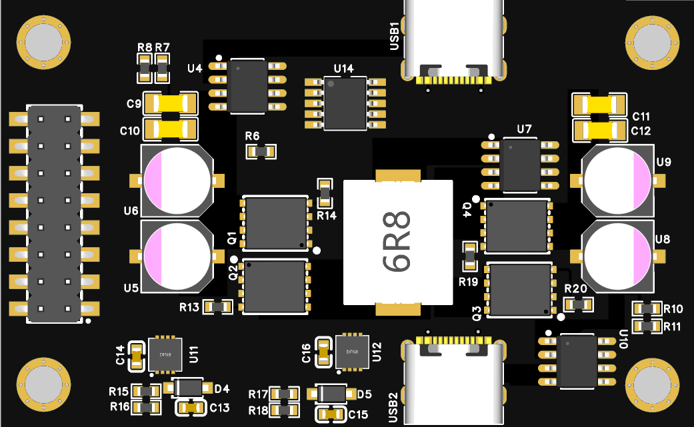
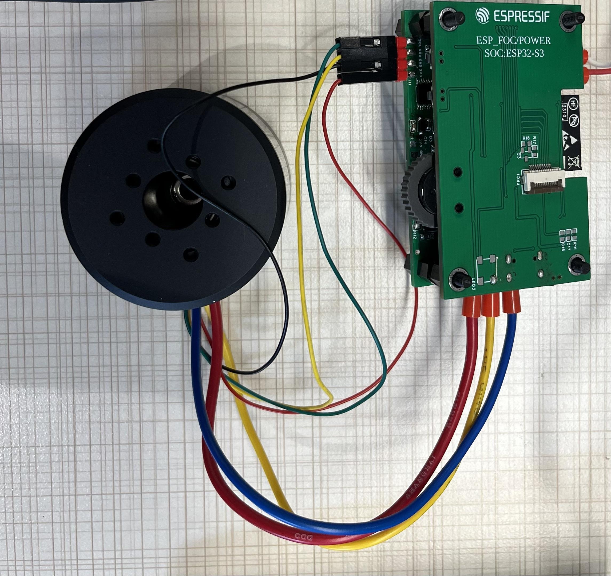

---


## Motor Control：项目进展

2. 高功率一体电机驱动控制系统

应用场景：工业水泵、工业风机等

* **高耐压**的MOS (N沟道 耐压:100V 电流:33A)
* **高耐压**的MOS驱动芯片 (耐压:300V 自带死区控制)
* **宽范围**的DC-DC稳压方案 (TX4139：4.5～75V input, adj ouput:0.8V~50V)
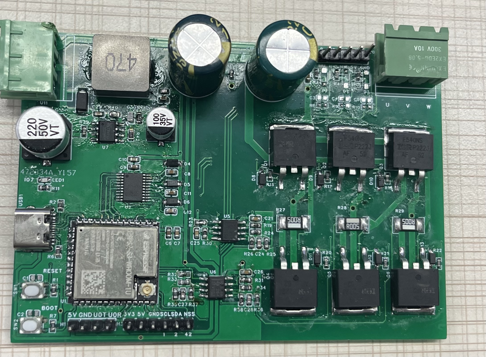

---
## Motor Control：项目进展

3. 多电机驱动控制系统(小功率)


应用场景：多关节机器人

* 采用**集成预驱与三路MOS**的驱动器 (DRV8313)
* **MCPWM与LEDC**实现4路电机控制 (esp_simplefoc)
* 支持速度模式与位置模式同时控制

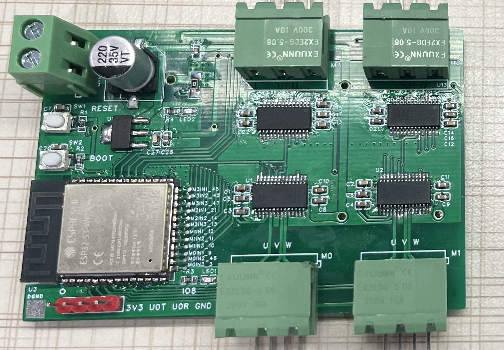

---
## Motor Control：项目进展
3. 基于**反电势**的无感方波BLDC控制系统 (六步换相)

应用场景：吊扇、落地扇

* 简化外围，无需加装位置检测传感器
* 基于**反电势检测**实现无感控制
* 支持**速度**控制、**堵转**保护、**过压欠压**保护

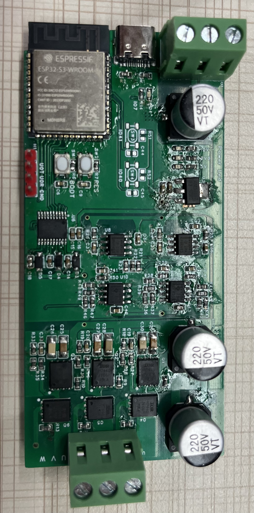

---

#### 无感实现原理

无刷电机在任意时刻总是两相通电工作，另相绕组是浮地不导通的。这时候非导通绕组的相电压就反映出该相绕组的感应电动势（BEMF）。

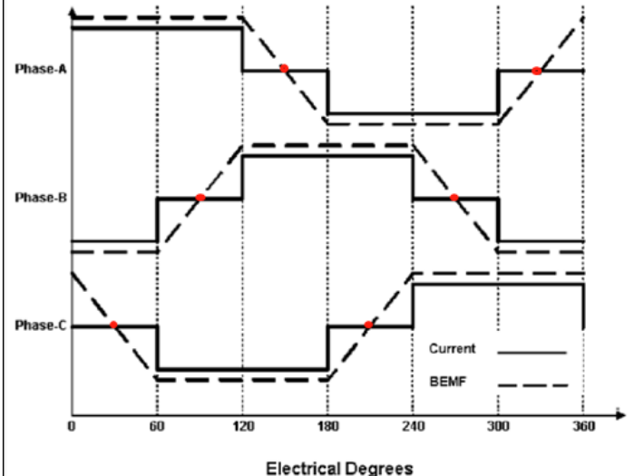
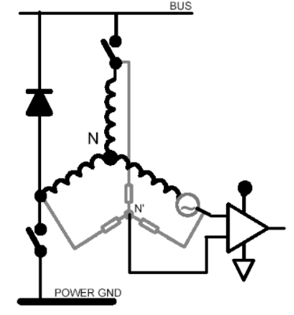


---

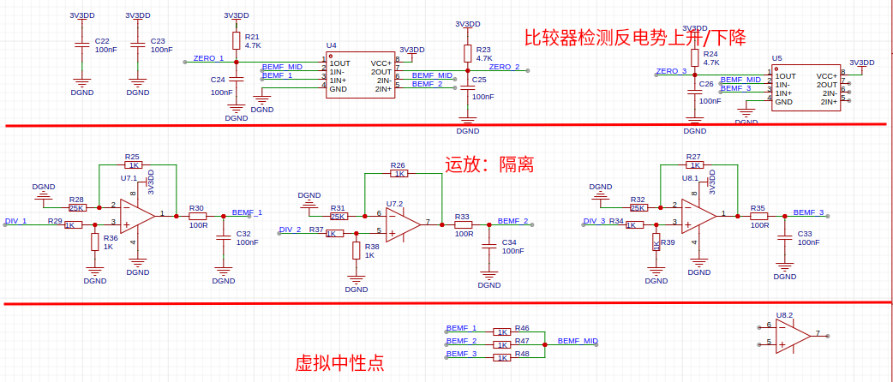

---

## Motor Control：项目进展
4. 基于esp_simplefoc与esp_now的四组机器狗控制

* esp_simplefoc模拟三挡开关与旋转按钮
* esp_now实现旋钮与esp_dog通讯

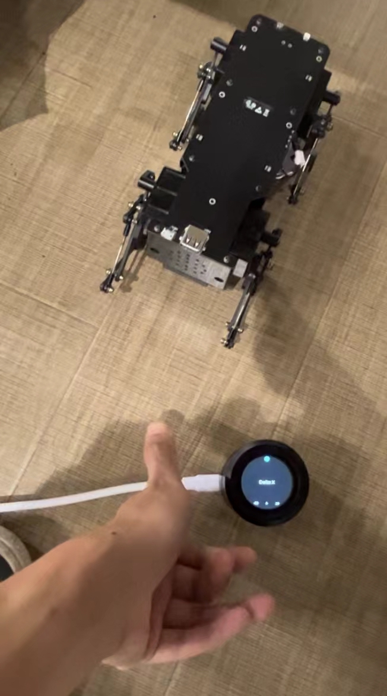

---


## Motor Control：外设需求

#### STMG4XX

* 高级模拟外设（比较器、运算放大器和 DAC）
* 支持硬件过采样的 ADC（16 位分辨率）

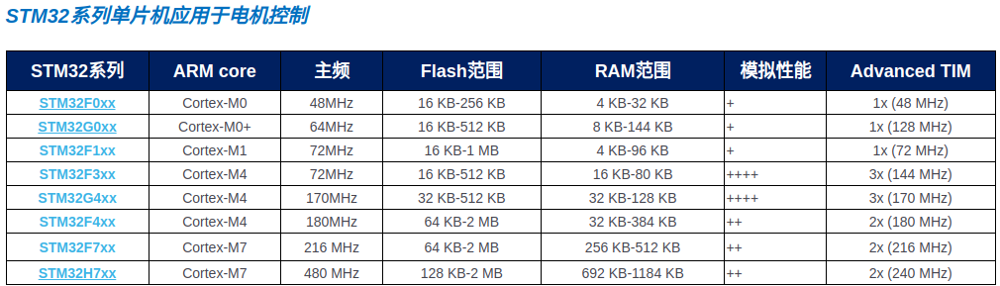

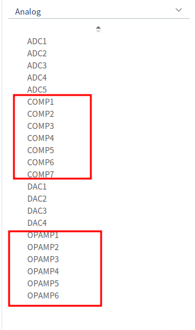

---

#### 峰岹 FU6815Q1

* 4路独立运算放大器，可编程可配置增益放大器
* 4路模拟比较器
* 内置MOS驱动器

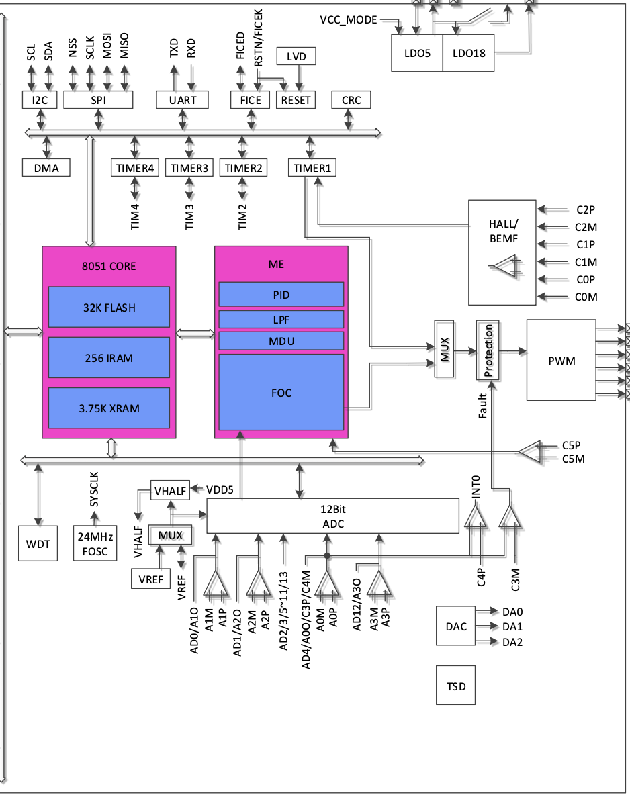

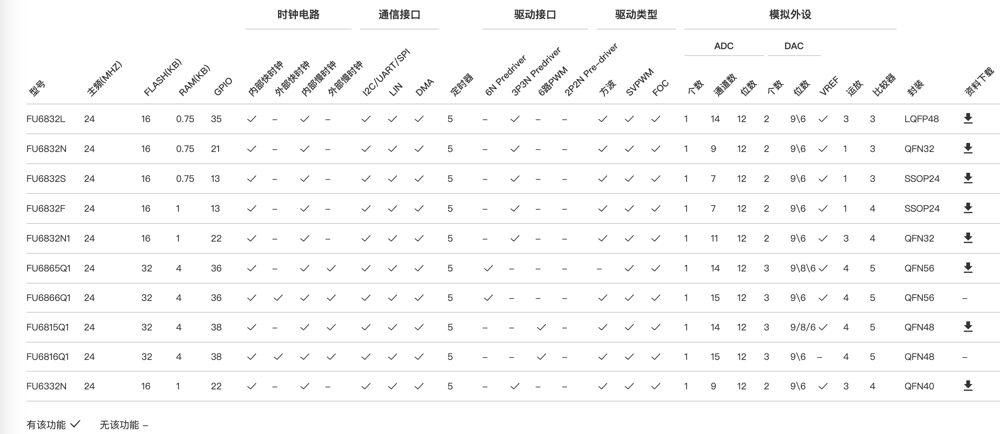

---

#### 先楫
* 4组共32路PWM输出，精度达2.5ns，4个正交编码器接口和4个霍尔传感器接口。
* 3 个 12 位高速 ADC，1 个 16 位高精度，4 个模拟比较器，多达 28 个模拟输入通道

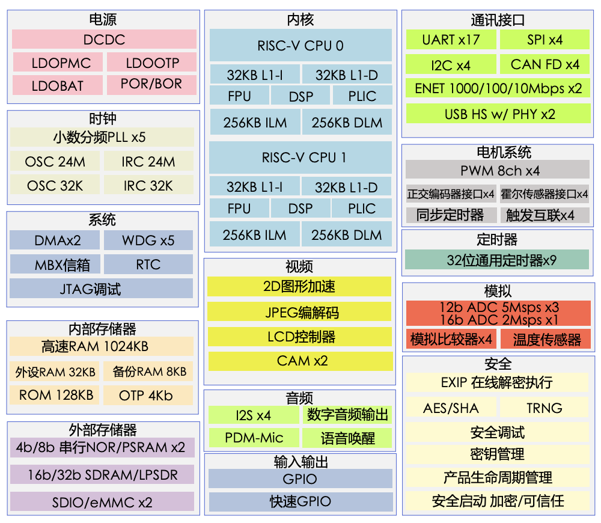


---

### 总结：
1. 高精度adc
2. 多路PWM输出单元
3. 可编程运放与内置比较器
4. 内置mos驱动 (小功率场景)


---

## 参考文档
[STM电机方案](https://www.stmcu.com.cn/ecosystem/app/Motor-control)

[FOC BLOG](https://www.robotsfan.com/posts/d99d1c1a.html)

[SVPWM BLOG](https://zhuanlan.zhihu.com/p/147659820)

[SVPWM矢量合成](https://www.zhihu.com/question/329038567/answer/1226721915)

[Firtior](https://www.fortiortech.com/product/detail/78)


[HPM](http://www.hpmicro.com/product/summary.html?id=d7fdb78f-1fa5-43be-be08-b97b405b65f0)


<!-- 磁链等于电压对时间的积分。
所以单位时间内磁链等效原理：U*T = U1*T1+U2*T2
也就是你说的伏秒平衡。 -->
